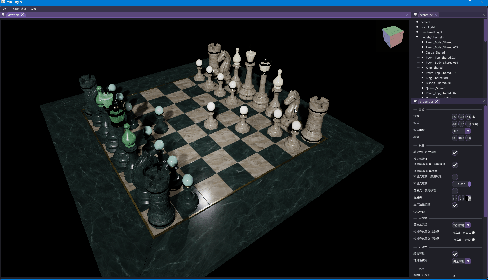
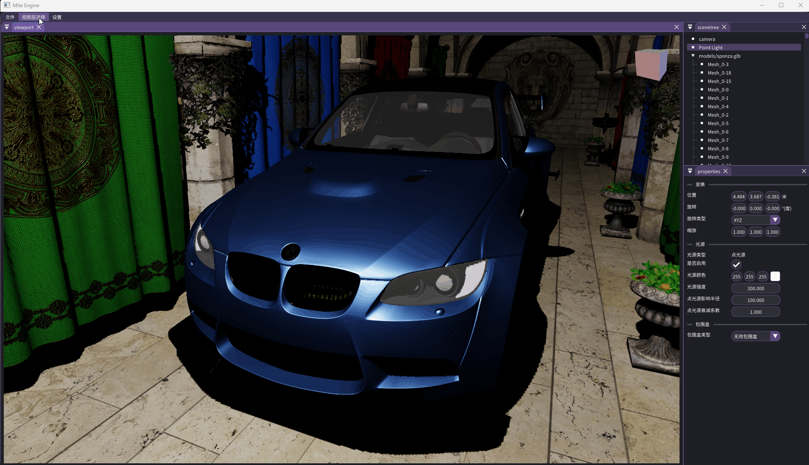
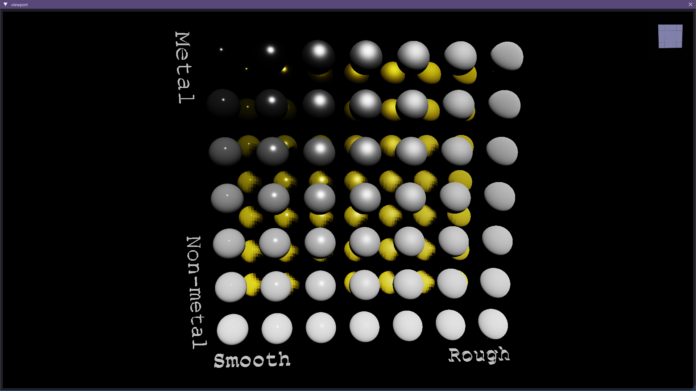
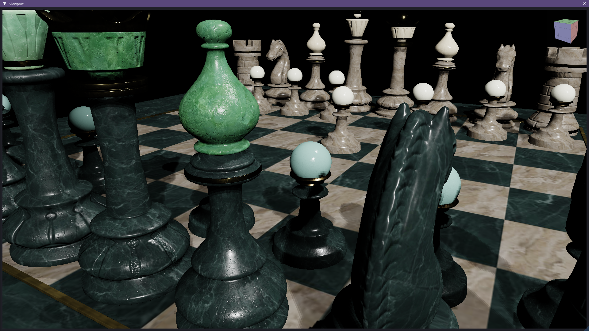
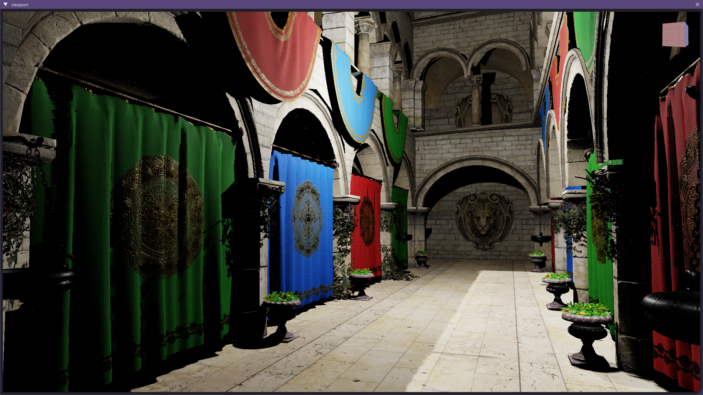
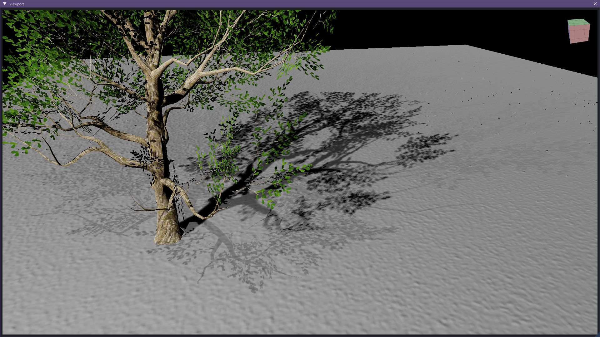
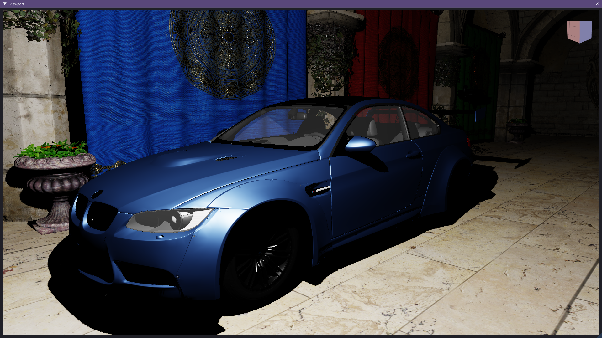
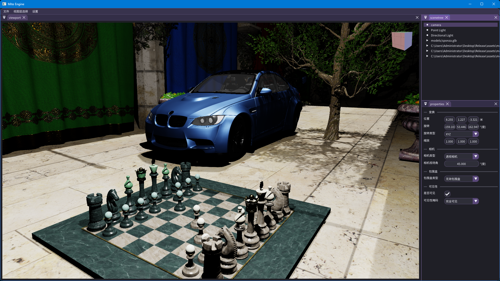
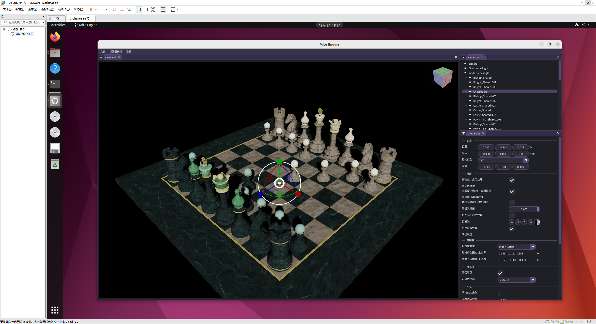
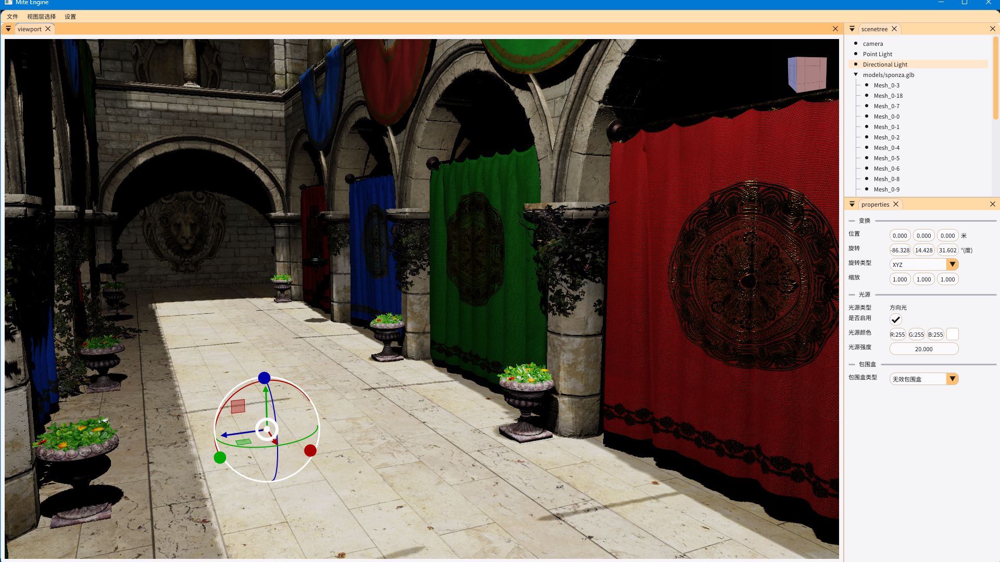

# MiteEngine

[](https://opensource.org/licenses/MIT)
[](https://en.cppreference.com/w/cpp/compiler_support)
[](https://cmake.org/)
[](https://www.opengl.org/)

[](https://github.com/mite085/MiteEngine/actions)
[](https://github.com/mite085/MiteEngine/actions)
[](https://github.com/mite085/MiteEngine/actions)

[](https://github.com/mite085/MiteEngine/actions)
[](https://github.com/yourusername/MiteEngine/actions)

**基于OpenGL的轻量级、模块化的C++三维图形引擎**

## 🚀 快速概览
**MiteEngine** 是一个采用C++17和OpenGL4.6构建的、面向学习和生产的三维图形引擎。它强调清晰的架构设计、高效的模块化组织和高性能的渲染管线，旨在为图形开发者提供一个易于理解、扩展和维护的现代图形引擎实现范例。
### ✨ 核心亮点
- **🎯 现代架构设计**：融合了**ECS数据层**、**事件驱动**和**模块化分层**等现代软件设计理念，确保代码结构清晰、职责明确。
- **🖼️ 高质量渲染管线**：实现了**PBR材质**、**ShadowMap阴影**，并构建了**ShadowMap-GBuffer-DeferredLighting-Forward-Blend混合渲染管线**，兼顾性能与视觉效果。
- **👨‍💻 开发者友好**：代码注释详尽（注释比例高达**28%**），[架构设计文档Design.md](./docs/00-Index目录.md)完备，模块边界清晰，依赖关系严格控制，极大降低了学习和二次开发的门槛。
- **🌍 跨平台支持**：已在 **Windows**、**Ubuntu (Linux)** 和 **macOS** 三大主流桌面平台完成自动化构建，并在**Windows**、**Ubuntu** 上运行测试，确保一致的开发体验。
- **📦 标准资产支持**：完整支持行业标准的 **GLTF 2.0** 模型格式加载，便于集成现有三维资产。
- **🛠️ 集成编辑器**：内置基于 **Dear ImGui** 的编辑器界面，包含视口、场景树、属性面板，支持**中文显示**与**样式切换**，开箱即用。
### 📊 项目规模
- **总代码量**：约**50,000**行
- **核心语言**：**C++**, **GLSL**, **CMake**

## 🎬 截图与演示

MiteEngine 提供了完整的可视化编辑器和多个精心设计的测试场景，全面展示引擎的渲染能力、交互功能和编辑器工作流。以下内容包含动态交互演示和静态渲染效果展示。

### 🎮 交互功能演示（动态GIF）

#### 1. 视图操控组件交互

* **功能**：展示编辑器右上角的**视图操控组件**，支持快速切换顶视图、前视图、侧视图等标准视角，以及视角复位功能。
* **技术体现**：直观的编辑器UI设计，提升场景编辑效率。

#### 2. 场景对象变换

* **功能**：演示在视口中**选择、移动、旋转、缩放**场景中的模型对象。
* **技术体现**：完整的场景图（Scene Graph）支持，实时的变换矩阵更新，与属性面板的联动。

#### 3. 自由相机漫游

* **功能**：展示**WASD**移动、鼠标拖拽旋转、滚轮缩放的**第一人称/观察者相机**控制模式。
* **技术体现**：灵活的相机系统，平滑的插值运动，与输入系统（Input Stack）的深度集成。

#### 4. 动态光源调整

* **功能**：实时**移动点光源/方向光**，观察场景光照与阴影的即时变化。
* **技术体现**：动态光源管理系统，实时的ShadowMap重计算，延迟光照管线的快速响应。

#### 5. 渲染管线阶段预览

* **功能**：**一键切换**渲染管线的中间结果与最终输出：
  - **G-Buffer分解**：世界坐标（World Position）、法线（Normal）、基础色（Base Color）
  - **延迟光照结果**（Deferred Lighting Output）
  - **前向渲染结果**（Forward Output）
  - **最终混合结果**（Final Blend Output）
* **技术体现**：**混合渲染管线**（ShadowMap→G-Buffer→Deferred→Forward→Blend）的完整实现，强大的调试与可视化能力。

### 🖼️ 渲染效果展示

<div align="center">

| 场景 | 截图 | 描述 |
| :--- | :--- | :--- |
| **材质球场景**<br>PBR材质测试 |  | • **核心技术**：PBR材质<br>• **测试重点**：金属度/粗糙度工作流<br>• **渲染阶段**：延迟光照 |
| **棋盘场景**<br>法线贴图测试 |  | • **核心技术**：法线贴图、纹理映射<br>• **渲染阶段**：G-Buffer生成 |
| **Sponza场景**<br>复杂光照与阴影 |  | • **核心技术**：ShadowMap、多光源管理<br>• **测试重点**：阴影质量、复杂场景渲染<br>• **渲染阶段**：延迟光照 |
| **树木场景**<br>Alpha测试（遮罩） |  | • **核心技术**：Alpha Test（Mask）<br>• **测试重点**：硬边透明、植被渲染<br>• **渲染阶段**：延迟光照 |
| **汽车场景**<br>透明混合渲染 |  | • **核心技术**：Alpha Blend<br>• **测试重点**：软透明、多层排序<br>• **渲染阶段**：透明混合阶段 |

</div>

### 🛠️ 引擎功能展示

<div align="center">

| 功能 | 截图 | 描述 |
| :--- | :--- | :--- |
| **编辑器界面**<br> |  | • **核心面板**：视口、场景树、属性面板、菜单栏<br>• **特色功能**：中文界面支持、实体组件编辑<br>• |
| **跨平台运行**<br>Ubuntu实机演示 |  | • **平台验证**：原生Linux支持与兼容性<br>• **一致性**：跨平台渲染效果一致<br>• **部署**：通过GitHub Actions自动化构建验证 |
| **界面主题**<br>浅色样式展示 |  | • **个性化**：支持浅色/深色主题切换<br>• **用户体验**：适应不同使用环境与偏好 |
| **开发中功能**<br> |  • **近期目标**：场景序列化/反序列化，支持场景保存与加载<br>• **架构演进**：Editor与Runtime分离<br>• **API支持**：Vulkan后端支持<br>• **未来规划**：光线追踪、后处理效果栈、骨骼/动画系统 | |

</div>

> **提示**：上述所有功能均可通过Releases界面下载并运行MiteEngine实时体验。编辑器提供了完整的交互界面，用户可以直接操作场景、修改属性并观察实时渲染结果。


## 🎨 功能特性

MiteEngine 集成了现代图形引擎的核心功能，从底层架构到上层渲染，提供了完整的三维图形解决方案。

### 🖌️ 渲染与图形 (Rendering & Graphics)
*   **🔦 混合渲染管线 (Hybrid Render Pipeline)**: 结合了延迟渲染与前向渲染的优势，执行流程为：**ShadowMap → G-Buffer → 延迟光照 (Deferred Lighting) → 前向渲染 (Forward) → 透明混合 (Blend)**。
*   **⚙️ 基于物理的渲染 (PBR)**: 完整实现了 **GLTF 2.0** 标准的基于物理的材质模型，支持金属度/粗糙度工作流。
*   **🌑 动态阴影**: 采用 **Shadow Mapping** 技术，为场景提供真实的动态阴影效果。
*   **🪟 透明度与遮罩**: 完整支持 **Alpha Mask**（遮罩）与 **Alpha Blend**（混合）两种透明物体渲染方式。
*   **🐛 调试视图**: 可实时切换并预览渲染管线的中间结果，包括：
    *   **G-Buffer**：世界坐标 (World Position)、法线 (Normal)、基础色 (Base Color)
    *   延迟光照结果 (Deferred Lighting Output)
    *   前向渲染结果 (Forward Output)
    *   最终混合结果 (Final Blend Output)

### 🏗️ 场景与架构 (Scene & Architecture)
*   **📊 ECS (实体-组件-系统) 架构**: 采用数据驱动的 **ECS** 模式管理场景对象，实现高效的缓存访问和灵活的逻辑组合。
*   **🌳 场景图 (Scene Graph)**: 基于 **SceneNode** 的树状场景结构，管理对象间的空间层次与变换继承关系。
*   **⚡ 空间加速结构**: 集成 **BVH (层次包围体)**，大幅加速视锥剔除 (Frustum Culling) 和光线投射 (Ray Cast) 等空间查询操作。
*   **🧩 高度模块化设计**: 引擎严格遵循单一职责原则，分解为 **15+** 个核心模块（如 Core, Event, Asset, Renderer, SceneCore等），模块间依赖关系清晰可控。

### 🛠️ 编辑器与工具 (Editor & Tooling)
*   **💻 集成可视化编辑器**: 基于 **Dear ImGui** 构建了功能完整的编辑器界面，包含四个核心面板：
    *   **视口面板 (Viewport Panel)**: 3D场景实时渲染与交互。
    *   **场景树面板 (Scene Tree Panel)**: 以树形结构展示和管理场景中的所有实体。
    *   **属性面板 (Properties Panel)**: 查看和编辑选中实体的详细组件属性。
    *   **菜单栏 (MenuBar)**: 提供文件、编辑、视图等操作入口。
*   **🌐 国际化与主题**: 支持 **中文显示**，并可灵活切换不同的 **UI 样式 (Style)**。
*   **🎮 交互式视口**: 支持通过鼠标和键盘进行场景漫游、对象选择与变换。

### 📦 资产与跨平台 (Asset & Cross-Platform)
*   **🗃️ 行业标准资产管道**: 内置完整的 **GLTF 2.0** 加载器，支持模型、网格、材质、纹理的一键导入。
*   **✅ 持续集成与跨平台构建**: 通过 **GitHub Actions** 实现自动化CI/CD，确保在 **Windows (MSVC)**、**Ubuntu (GCC/Clang)** 和 **macOS (Clang)** 上的持续构建与测试通过。
*   **🚦 代码质量保障**: 集成自动化 **Clang-Format** 检查，确保代码风格统一。

### 🧪 演示与测试 (Demos & Testing)
*   提供多个内置的**测试场景**，用于展示引擎的各项功能与渲染效果。
*   引擎本身即是一个可运行的**演示程序**，可直接体验编辑器所有功能。

## 🛠️ 技术栈与统计

MiteEngine 基于现代、稳定且广泛使用的技术栈构建，确保了项目的性能、可维护性和可扩展性。

### 📚 核心技术栈

| 类别 | 技术/库 | 版本/说明 | 主要用途 |
| :--- | :--- | :--- | :--- |
| **语言与标准** | C++ | C++17 | 核心开发语言 |
| **图形API** | OpenGL | 4.6 | 底层图形渲染 |
| **窗口与输入** | GLFW | 3.3 | 跨平台窗口创建与管理 |
| **用户界面** | Dear ImGui | docking分支 | 编辑器GUI实现 |
| **数学库** | GLM | 最新 | 图形数学运算（向量、矩阵） |
| **资产加载** | Assimp | 5.0 | 模型文件（GLTF等）导入 |
| | stb_image | 最新 | 纹理图片加载 |
| | meshoptimizer | 最新 | 网格数据处理与优化 |
| **工具库** | spdlog | 最新 | 高性能日志记录 |
| | stduuid | 最新 | UUID生成 |
| **构建系统** | CMake | 3.10 | 跨平台项目构建与依赖管理 |
| **着色器编译** | Shaderc | 集成 | GLSL着色器离线编译与优化 |

### 📊 代码规模与质量
项目总规模约 **31,000+** 行有效代码，体现了完整的引擎实现复杂度。详细的代码统计如下（使用 `cloc` 生成）：
| 语言 | 文件数 | 代码行 | 注释行 | 空白行 | 总计 | 注释比例 |
| :--- | :---: | :---: | :---: | :---: | :---: | :---: |
| **C++源文件** | 141 | 19,035 | 3,304 | 3,510 | 25,849 | 14.8% |
| **C++头文件** | 174 | 9,484 | 8,019 | 2,457 | 19,960 | 45.8% |
| **GLSL着色器** | 22 | 1,310 | 709 | 443 | 2,462 | 35.1% |
| **CMake脚本** | 29 | 1,367 | 289 | 230 | 1,886 | 17.4% |
| **总计** | **366** | **31,196** | **12,321** | **6,640** | **50,157** | **28.3%** |

**关键指标解读：**
- **卓越的文档化**：整体注释比例高达 **~28.3%**，其中**头文件注释比例接近 46%**。接口定义、类说明、关键算法都有详尽的文档，极大降低了学习成本和维护难度。
- **完整的图形管线**：**22个GLSL着色器文件**覆盖了从阴影、几何缓冲到光照计算的全套渲染阶段，每个着色器都有详细的注释说明。
- **专业的工程管理**：**29个CMake脚本**文件确保了跨平台构建的可靠性和可重复性。
### 🔗 第三方依赖管理
- 主要第三方库均通过 **Git Submodules** 集成，确保版本可控和构建一致性。
- CMake脚本自动处理依赖的查找、编译与链接，用户只需一条命令即可完成环境准备与项目构建。

## 🏗️ 架构展示

MiteEngine 采用精心设计的模块化分层架构，各模块职责清晰、依赖关系严格，确保了系统的高内聚、低耦合和良好的可扩展性。

### 📐 核心架构图

以下图表展示了引擎各模块之间的分层依赖关系：

```mermaid
graph TD
    %% 最底层模块
    Core[Core工具]
    Event[Event事件]
    
    %% 第二层：仅依赖最底层
    Input[Input输入] --> Core
    Input --> Event
    Data[Data数据] --> Core
    Data --> Event
    
    %% 第三层：依赖Data和最底层
    Material[Material材质] --> Data
    Light[Light光照] --> Data
    Shader[Shader着色器] --> Data
    
    %% 第四层：依赖Material/Light和SceneCore
    Asset[Asset资产] --> Data
    Asset --> Material
    SceneCore[SceneCore场景核心] --> Material
    SceneCore --> Data
    SceneCore --> Light
    
    %% 第五层：依赖SceneCore
    SceneGraph[SceneGraph场景图] --> SceneCore
    
    %% 第六层：依赖SceneGraph和SceneCore
    SceneView[SceneView场景视图] --> SceneGraph
    
    %% 第七层：依赖SceneView
    Renderer[Renderer渲染] --> SceneView
    Renderer --> Shader
    
    %% 第八层：依赖最底层和Input
    Window[Window窗口] --> Input
    
    %% 第九层：依赖Renderer和Window
    UI[UI用户界面] --> Renderer
    UI --> Window
    
    %% 最顶层：依赖所有功能模块
    Application[Application应用程序] --> Asset
    Application --> UI

    %% 样式定义
    classDef bottom fill: #bbdefb
    classDef middle fill: #ffe0b2
    classDef top fill: #e1bee7
    
    class Input,Data,Core,Event,Material,Light,Shader bottom
    class Asset,SceneCore,SceneGraph,SceneView,Renderer,Window middle
    class UI,Application top
````

架构分层解读：
- 基础层 (🔵蓝色): Core, Event, Data, Input 等提供最基础的运行时支持。
- 核心层 (🟠橙色): Asset, SceneCore, Renderer 等实现引擎的核心数据管理与渲染逻辑。
- 应用层 (🟣紫色): UI, Application 构建最终的用户界面和应用程序。

### 🔄 混合渲染管线流程

引擎的渲染管线为混合式架构，结合了延迟渲染和前向渲染的优势：
```mermaid
graph LR
    B(ShadowMap Pass<br/>阴影贴图生成);
    B --> C(GBuffer Pass<br/>几何缓冲填充);
    C --> D(Deferred Lighting Pass<br/>延迟光照计算);
    D --> E(Forward Pass<br/>前向渲染透明/特殊物体);
    E --> F(Blend/Post-Process Pass<br/>混合与后处理);
    
    style B fill:#ffebee
    style C fill:#e8f5e8
    style D fill:#e3f2fd
    style E fill:#fff3e0
    style F fill:#f3e5f5
````

管线阶段说明：
- ShadowMap Pass: 从光源视角渲染深度图，用于后续阴影计算。
- G-Buffer Pass: 将场景的几何信息（位置、法线、材质参数等）渲染到多个渲染目标（MRT）中。
- Deferred Lighting Pass: 利用G-Buffer中的数据，在屏幕空间中进行高效的光照计算。
- Forward Pass: 渲染透明物体、UI等不适合延迟渲染的对象。
- Blend Pass: 混合所有渲染结果（并可在此阶段加入后处理效果）。

### 📦 关键模块职责速览
| 模块 | 核心职责 | 关键设计 |
| :--- | :--- | :--- |
| **`SceneCore`** | ECS架构核心 | Entity/Component注册表，组件系统管理器，脏标记更新 |
| **`SceneGraph`** | 空间结构与加速 | SceneNode树，BVH加速结构，视锥剔除，射线检测 |
| **`Renderer`** | 渲染命令执行 | 多阶段渲染管线，RenderCommand队列，渲染状态管理 |
| **`Asset`** | 资源生命周期 | GLTF加载，纹理/材质缓存，LOD自动生成 |
| **`Event`** | 模块间通信 | 中心化事件总线，支持同步/异步/延迟事件分发 |

### 🎯 设计理念总结
- 模块化与分层: 严格遵循单一职责原则，通过CMake的target_link_libraries控制依赖方向。
- 数据驱动: ECS架构使游戏逻辑与数据分离，提升缓存友好性和系统灵活性。
- 事件驱动: 通过EventBus实现模块间解耦，提高代码的可测试性和可维护性。
- 混合渲染: 结合延迟渲染的效率与前向渲染的灵活性，适应复杂的渲染需求。

此架构为引擎的稳定性、性能优化和未来功能扩展（如Vulkan后端、新的渲染特性）奠定了基础。


